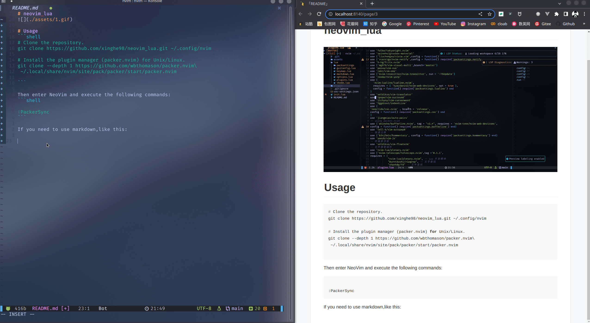

<!-- TOC Marked -->

+ [screenshots](#screenshots)
+ [Usage](#usage)

<!-- /TOC -->
# screenshots
 

# Usage
```bash
# Clone the repository.
git clone https://github.com/xinghe98/neovim_lua.git ~/.config/nvim

# Install the plugin manager (packer.nvim) for Unix/Linux.
git clone --depth 1 https://github.com/wbthomason/packer.nvim\
 ~/.local/share/nvim/site/pack/packer/start/packer.nvim

```

Then enter NeoVim and execute the following commands:
```bash
:PackerSync
```

If you need to use markdown,like this:

 

```bash
cd ~/.local/share/nvim/site/pack/packer/start/markdown-preview.nvim/app/

yarn install
```

So you also need to install other environment dependencies:

```bash
sudo pacman -S python-pip go nodejs npm yarn
```


Install ctags for vista.nvim if you are not using coc:

```bash
sudo pacman -S ctags
```

Don't forget to install the language highlighting you need using tsinstall:

```bash
# eg:
:TsInstall python
```
