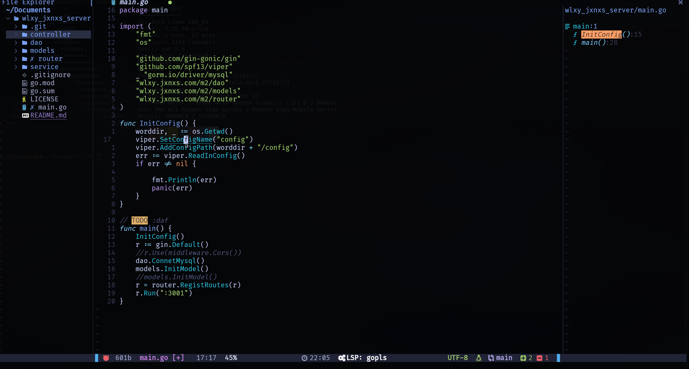
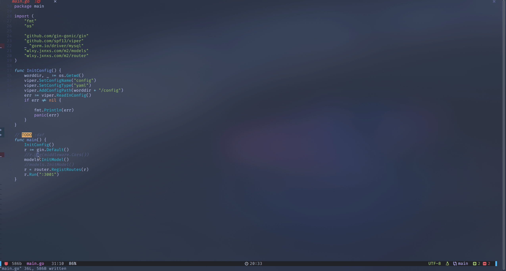
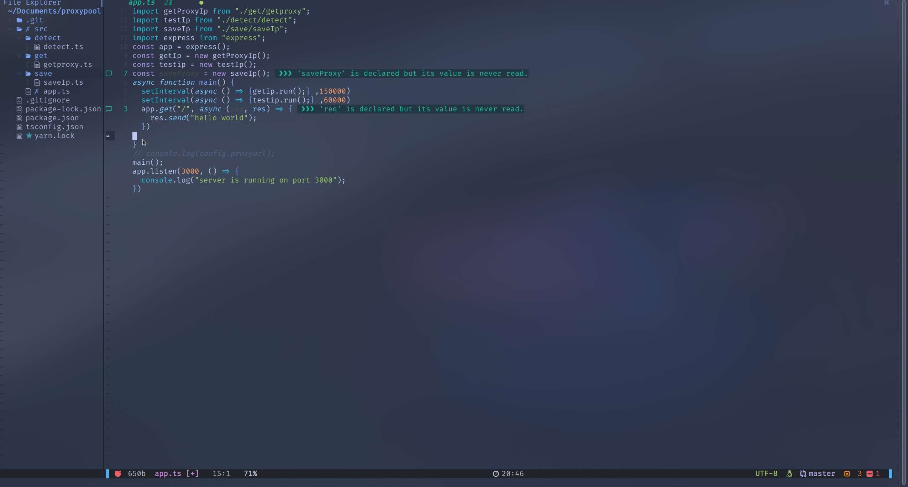
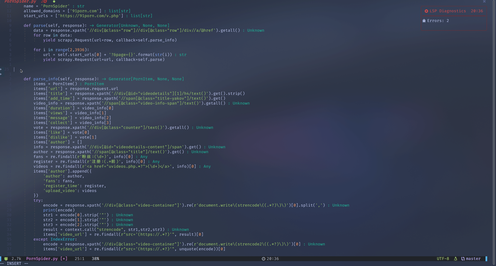

<!-- TOC Marked -->

+ [说明](#说明)
+ [展示](#展示)
	* [golang](#golang)
	* [typeScript](#typescript)
	* [python](#python)
+ [安装方法](#安装方法)
+ [键盘配置映射表](#键盘配置映射表)

<!-- /TOC -->
# 说明

`coc` 和`lsp` 都尝试过，最终选择了`coc` ，因为设置方便，小bug更少，且作者是个中国人。

# 展示

## golang

 

## typeScript

 

## python

 

# 安装方法

安装方法及其他依赖详见：[REDME](https://github.com/xinghe98/neovim_lua/tree/main#usage) 

# 键盘配置映射表

| 模式   |         快捷键        |       操作      |          说明          |
|--------|:---------------------:|:---------------:|:----------------------:|
| normal |           H           |        ^        |     快速移动至行首     |
| normal |           L           |        $        |     快速移动至行尾     |
| normal |       \<leader>l      |      <C-w>l     |   将焦点移动至左窗口   |
| normal |       \<leader>k      |      <C-w>k     |   将焦点移动至上窗口   |
| normal |       \<leader>h      |      <C-w>h     |   将焦点移动下至窗口   |
| normal |       \<leader>j      |      <C-w>j     |   将焦点移动至右窗口   |
| normal |         S-tab         |        <<       |        减少缩进        |
| normal |          tab          |        >>       |          缩进          |
| visual |         S-tab         |        <        |        减少缩进        |
| visual |          tab          |        >        |          缩进          |
|        |           J           |        5j       |         下移5行        |
|        |           K           |        5k       |         上移5行        |
| normal |           qq          |   :nohlsearch   |      退出搜索高亮      |
| normal |   \<leader>\<leader>  |       :bn       | 移动到下一个buffer窗口 |
| normal | \<leader>\<backspace> |       :bp       | 移动到上一个buffer窗口 |
| normal |         \<c-w>        |       :bd       |   关闭当前buffer窗口   |
| normal |         \<S-s>        |        :w       |          保存          |
| normal |         \<S-q>        |        :q       |          退出          |
| insert |         \<C-a>        |     \<Home>     |    编辑的时候到行首    |
| insert |         \<C-e>        |      \<End>     |    编辑到时候到行尾    |
| normal |       \<leader>t      | :TranslateW<CR> |          翻译          |
| visual |       \<leader>t      | :TranslateW<CR> |          翻译          |
| normal |           (           |        %        |     找到匹配到符号     |
|        |      \<leader\>cc     |                 |          注释          |
|        |           gd          |                 |       跳转到定义       |
| normal |         \<C-t>        |                 |    打开或者关闭终端    |
